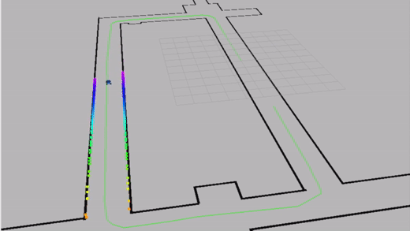

# ROS2 Controller Package for Self Driving Car

Given coordinates of a path to follow, this ROS package allows the car to follow the path using controlers (eg. PID and LQR).



# Instalation

## System Requirement

We recommend using Linux system to run this ROS package.

## How to run PID Controller

First, git clone this package to appropriate src folder. Then, compile the controller package in ROS2.
```
colcon build --packages-select controller_pkg
source /opt/ros/foxy/setup.bash
source install/local_setup.bash
```
Then, you can launch PID controller by running the following command.
```
ros2 launch controller_pkg pid_launch.launch.py
```

# Overview

## Input (Subscribing)

- **Localization data**
- **Path data**

## Output (Publishing)

- **Acceleration**
- **Steering**

# PID Controller

A [PID Controller](https://en.wikipedia.org/wiki/PID_controller#:~:text=A%20proportional%E2%80%93integral%E2%80%93derivative%20controller,continuously%20calculates%20an%20error%20value)

# LQR Controller