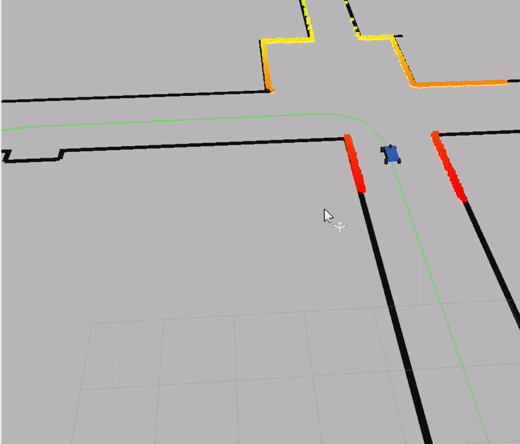
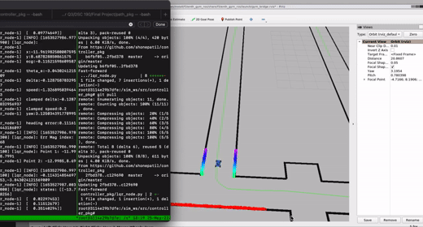

# ROS2 Controller Package for Self Driving Car

Given coordinates of a path to follow, this ROS2 package allows the car to follow the path using controlers (eg. PID and LQR). [Here](https://docs.google.com/document/d/1p193sd0xH9MkXmNO3VeS7I8w-1QvZ5OEhzpqFabwr0k/edit?usp=sharing) is our report, and [here](https://docs.google.com/presentation/d/1H5FHX5CmrK70eJTGlJmzeryEGKBkP8fqUc0uEpG2vxo/edit?usp=sharing) is our presentation.


# Instalation

## System Requirement

We recommend using Linux system to run this ROS2 package.

## How to run PID Controller

First, git clone this package to appropriate src folder. Then, compile the controller package in ROS2.
```
colcon build --packages-select controller_pkg
source /opt/ros/foxy/setup.bash
source install/local_setup.bash
```
Then, you can launch PID controller by running the following command.
```
ros2 launch controller_pkg pid_launch.launch.py
```

# Overview

## Input (Subscribing)

- **Localization data**

The car takes in the $x$ and $y$ coordinates of the position, which is used to calculate the Cross Track Error.

- **Path data**

The controller subscribes to a path node, and it takes in $x$ and $y$ coordinates of the path the car needs to follow.

## Output (Publishing)

- **Acceleration**

- **Steering**

# PID Controller

A [PID Controller](https://en.wikipedia.org/wiki/PID_controller#:~:text=A%20proportional%E2%80%93integral%E2%80%93derivative%20controller,continuously%20calculates%20an%20error%20value) is a simple controller that makes use of the Cross Track Error, which is the distance between the car and the path the car needs to follow.

```
ros2 launch controller_pkg pid_launch.launch.py
```



# LQR Controller

A [LQR Controller](https://en.wikipedia.org/wiki/Linear%E2%80%93quadratic_regulator) is a more advanced controller system with more parameters. While the controller still takes into account of the Cross Track Error, it also considers the orientation of the car.

```
ros2 launch controller_pkg lqr_launch.launch.py
```

